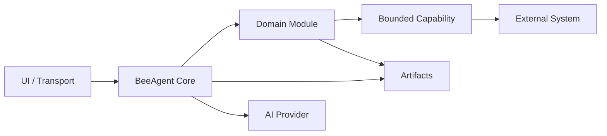

# BeeAgent — Modular Agent Runtime for Bounded AI Workflows

**BeeAgent** is a modular, stateful runtime for building explainable AI-assisted systems with explicit boundaries between orchestration, domain logic, external capabilities, and user interfaces.

BeeAgent is not designed as a chatbot with an unrestricted collection of tools.

Its core model is:

```text
UI / Transport
      ↓
BeeAgent Core
      ↓
Domain Module
      ↓
Bounded Capability
      ↓
External System
```

The runtime owns state, policy, authority, artifacts, module loading, execution boundaries, and observability.

Domain-specific business logic lives in separate modules.

## Why BeeAgent

AI applications often mix too many responsibilities in one place:

- conversation state;
- business rules;
- tool execution;
- credentials;
- external APIs;
- approval logic;
- UI;
- persistence;
- AI decisions.

BeeAgent separates these concerns.

The main design goal is:

> Keep domain intent separate from execution authority.

A module may request an approved operation, but it does not automatically gain shell, filesystem, RPC, credential, or external-system authority.

BeeAgent remains the host and policy boundary.

## Architecture



### BeeAgent Core

The core owns platform-level behavior:

- runtime and session context;
- run identity;
- configuration and fail-fast validation;
- module discovery and loading;
- module dispatch;
- artifact storage API;
- approvals and policy;
- capability boundaries;
- bounded external execution;
- logging and observability;
- transport and UI integration;
- authentication and authorization surfaces;
- timeout, lifecycle, and cleanup behavior.

### Domain Modules

Modules own business or product semantics.

A module should contain things such as:

- domain models;
- rules;
- classification;
- analysis;
- recommendations;
- domain-specific evaluation;
- domain-specific artifacts.

A module should not become a second runtime.

It should not own generic:

- process lifecycle;
- credential management;
- storage infrastructure;
- arbitrary network execution;
- transport handling;
- global authentication;
- host policy.

Domain modules may be open source or private.

This allows BeeAgent itself to remain a reusable framework while commercial or customer-specific products can live in separate private packages.

### Capabilities

Capabilities are narrow host-controlled integration or execution surfaces.

Examples include:

- external APIs;
- MCP tools;
- workflow systems such as n8n;
- local document processing;
- isolated blockchain execution;
- CRM integrations;
- other bounded system operations.

A capability is not a generic escape hatch.

The intended model is:

```text
module intent
    ↓
host validation
    ↓
scoped capability
    ↓
approved operation
    ↓
bounded evidence/result
```

Long-running state belongs in BeeAgent, not inside one external tool call.

## Module Contract

BeeAgent loads package-based domain modules through a config-driven registry.

The current module model is intentionally small:

```python
class ModuleContract(Protocol):
    @property
    def module_id(self) -> str: ...

    @property
    def authority(self) -> AuthorityLevel: ...

    def supported_case_types(self) -> list[str]: ...

    def handle(self, context: ModuleContext) -> ModuleResult: ...
```

At runtime BeeAgent creates the context and binds it to the current host-owned run and session.

Conceptually:

```text
ModuleContext
├── run_id
├── session_id
├── module_id
├── case_type
├── authority
├── payload
├── artifact_api
└── capability_caller
```

The module returns a bounded `ModuleResult`.

BeeAgent remains responsible for host execution and persistence.

## Authority Model

BeeAgent uses explicit authority levels:

```text
read_only
draft_only
execution_capable
```

A module's declared authority is not equivalent to host execution authority.

For example, a `read_only` module may receive a host-scoped capability for one specific isolated operation without becoming generally execution-capable.

This preserves the distinction:

```text
module intent != execution authority
```

## Artifacts and Explainability

BeeAgent is artifact-oriented.

Runs can produce structured evidence under `storage/`, including:

```text
storage/
├── runs/
├── artifacts/
├── reports/
├── interfaces/
├── sessions/
└── telemetry/
```

Artifacts are used for:

- reproducibility;
- debugging;
- operator review;
- module outputs;
- integration evidence;
- read models;
- audit-friendly execution traces.

The basic principle is:

> Important runtime behavior should be explainable through config, logs, and artifacts.

Artifacts must remain bounded and must not contain secrets or unrestricted raw external data.

## AI Model

AI is an assistive layer, not an authority boundary.

BeeAgent supports configurable AI provider profiles and bounded provider calls, but AI output must pass application-specific validation before it can affect deterministic state or execution.

The intended model is:

```text
deterministic evidence
        +
bounded AI assistance
        ↓
validated result
        ↓
policy-controlled action
```

AI output does not automatically grant:

- CRM mutation;
- mailbox mutation;
- arbitrary tool execution;
- filesystem access;
- credential access;
- external-system authority.

Critical execution authority remains host-controlled.

## User Interfaces and Transports

BeeAgent currently supports multiple interaction surfaces.

### Telegram

Telegram can be used as an operator transport for interactive workflows.

```bash
./start.sh telegram
```

### Operator Web Console

BeeAgent includes a BeeUI-backed web console:

```bash
./start.sh web
```

The web layer provides platform surfaces such as:

- dashboard;
- run history;
- run details;
- module diagnostics;
- bounded artifact views;
- JSON APIs;
- authenticated operator surfaces.

Web access can be protected by config-driven principals, roles, scopes, and signed BeeUI sessions.

The default bind is local:

```text
127.0.0.1
```

Externally exposed deployments should use the authentication boundary and appropriate deployment hardening.

### CLI

The canonical entrypoint is:

```bash
./start.sh
```

Useful framework-level commands include:

```bash
./start.sh
./start.sh telegram
./start.sh web
./start.sh web --host 127.0.0.1 --port 8780 --no-open
./start.sh routes
./start.sh docling-assets-prepare

./start.sh auth rotate <principal>
./start.sh auth rotate all
./start.sh auth rotate all --logout-all
./start.sh auth rotate session
```

Individual domain modules may expose additional workflow-specific CLI commands.

Those commands are not the core BeeAgent module contract.

## Local Document Processing

BeeAgent includes a bounded local document-extraction path.

The currently implemented engine is:

```text
Docling
+ RapidOCR
+ ONNX Runtime
```

Supported document classes include bounded handling for:

- text;
- CSV;
- PDF;
- DOCX;
- XLSX;
- JPEG;
- PNG.

Document parsing runs through a bounded local worker with timeout and explicit failure handling.

Customer document contents are treated as untrusted input.

Documents do not grant execution authority.

Where configured, model assets are prepared ahead of runtime and extraction operates without silently downloading models during document processing.

## Configuration

The runtime source of truth is:

```text
config/settings.yml
```

Secrets live in environment variables or `.env`, not in YAML.

The startup path:

- creates `.env` from `.env.example` when needed;
- synchronizes missing environment keys without overwriting existing values;
- generates approved internal secrets where required;
- validates required configuration;
- resolves the runtime dependency profile;
- starts the selected runtime.

External credentials are never generated automatically.

Typical examples include credentials for:

- AI providers;
- Telegram;
- mailboxes;
- CRM systems;
- external connectors.

## Security Model

BeeAgent treats external input as untrusted by default.

Key rules:

- secrets belong in environment-backed storage;
- required security-sensitive configuration is validated fail-fast;
- module intent does not equal execution authority;
- capabilities are explicitly scoped;
- arbitrary caller-selected executable paths are not capability contracts;
- arbitrary RPC targets are not accepted by bounded execution paths;
- artifact access is allowlist-based;
- path traversal must fail closed;
- raw secrets must not appear in logs or artifacts;
- external failures remain explicit rather than being converted into successful evidence;
- execution-capable paths require stronger review than read-only paths;
- local development defaults must not silently become production security defaults.

See [`docs/SECURITY.md`](docs/SECURITY.md) for the detailed engineering rules.

## Project Structure

```text
beeagent/
├── config/
│   ├── start.py
│   ├── settings.yml
│   ├── beeui.yml
│   ├── prompts.yml
│   └── i18n/
├── docs/
│   ├── ARCHITECTURE.md
│   ├── DEV_GUIDE.md
│   ├── ROADMAP.md
│   ├── SDLC.md
│   ├── SECURITY.md
│   ├── SPEC.md
│   └── WEB_UI.md
├── src/
│   └── beeagent_module/
│       ├── adapters/
│       ├── agents/
│       ├── cases/
│       ├── cli/
│       ├── core/
│       ├── domain/
│       ├── interfaces/
│       │   └── ui/
│       ├── mock/
│       ├── ui/
│       └── web/
├── storage/
├── tests/
├── pyproject.toml
├── start.sh
└── uv.lock
```

The main architectural boundary is more important than the directory layout:

```text
BeeAgent
  = host runtime + orchestration + authority

Domain module
  = business/product semantics

Capability
  = bounded external execution/integration

BeeUI / transport
  = interaction layer
```

## Requirements

BeeAgent currently targets:

```text
Python >= 3.14
uv
```

`start.sh` can bootstrap `uv` when it is not already installed.

The project uses a locked `uv` environment for reproducible development and runtime setup.

## Development Setup

### Important: current workspace dependency model

The current `main` branch is still developed as part of the Bee workspace.

`pyproject.toml` currently declares sibling editable sources including:

```text
../beesdk
../beedrill
../beeagent-rop
```

Some domain modules may be private.

As a result, the current repository is **not yet a completely standalone external installation from a fresh public clone**.

This is a packaging/dependency-boundary limitation, not an architectural requirement of BeeAgent.

The intended framework model is that domain modules can be installed independently and can remain private.

### Bee workspace development

With the required sibling packages available:

```bash
git clone https://github.com/beesyst/beeagent.git
cd beeagent

./start.sh
```

Explicit runtime:

```bash
./start.sh telegram
```

or:

```bash
./start.sh web
```

Run tests:

```bash
uv run --frozen pytest -q
```

The normal application entrypoint is `./start.sh`; a separate install command is not required for the current workspace development flow.

## Extending BeeAgent

When adding a new product or customer workflow, prefer a separate domain package instead of adding business rules to BeeAgent core.

A typical integration looks like:

```text
my-domain-module
        ↓
ModuleContract
        ↓
BeeAgent runtime
        ↓
Artifact API + scoped capabilities
        ↓
external systems
```

Use BeeAgent core only when functionality is genuinely platform-level.

Examples of platform-level behavior:

- runtime context;
- policy;
- artifact infrastructure;
- generic module loading;
- authorization;
- capability dispatch;
- process lifecycle;
- shared transport behavior.

Examples of module-level behavior:

- customer classification rules;
- security scenario semantics;
- sales logic;
- domain scoring;
- domain-specific recommendations;
- customer-specific workflow decisions.

## Public Core, Private Products

BeeAgent is intentionally compatible with a mixed open/private architecture.

For example:

```text
Public or reusable
├── BeeAgent runtime
├── shared SDK/contracts
└── reusable infrastructure

Private or product-specific
├── customer modules
├── commercial domain logic
├── customer configuration
└── proprietary integrations
```

This keeps the orchestration framework reusable without forcing commercial domain logic into the public repository.

## Development Principles

BeeAgent follows a small set of architectural rules:

1. **KISS** — add abstractions only when real behavior requires them.
2. **Config is source of truth** — required runtime behavior is explicit.
3. **Explainability first** — config, logs, and artifacts should explain important behavior.
4. **Thin UI** — UI must not bypass runtime/module boundaries.
5. **Module boundary** — business logic belongs in domain modules.
6. **Bounded capabilities** — external execution must be narrow and host-controlled.
7. **Bounded AI** — AI assists decisions but does not become unrestricted authority.
8. **Fail closed** — missing or contradictory critical evidence must not silently become success.

## Documentation

Detailed project documentation lives under [`docs/`](docs/):

- [`docs/ARCHITECTURE.md`](docs/ARCHITECTURE.md) — ownership and system boundaries;
- [`docs/SPEC.md`](docs/SPEC.md) — current platform contracts;
- [`docs/ROADMAP.md`](docs/ROADMAP.md) — development stages and iterations;
- [`docs/DEV_GUIDE.md`](docs/DEV_GUIDE.md) — development and runtime workflows;
- [`docs/SDLC.md`](docs/SDLC.md) — lightweight development process;
- [`docs/SECURITY.md`](docs/SECURITY.md) — security engineering rules;
- [`docs/WEB_UI.md`](docs/WEB_UI.md) — Operator Web Console contract.

For implementation details, these documents are the source of truth rather than this README.
