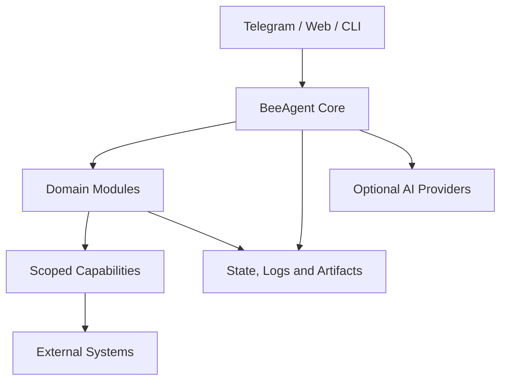

# BeeAgent — Modular Agent Runtime

**Build AI-assisted workflows with explicit boundaries, bounded capabilities, and reproducible evidence.**

BeeAgent is a modular, stateful Python runtime for building explainable automation and AI-assisted systems. It separates orchestration, domain logic, external execution, and user interfaces.

BeeAgent is not a collection of unrestricted AI tools. The host controls what modules can access and execute.

## Why BeeAgent

Real-world automation combines state, business rules, credentials, external APIs, AI models, approvals, user interfaces, and persistent artifacts.

BeeAgent separates these concerns so domain modules can focus on their own logic without owning the underlying runtime or its security boundaries.

The core principle is:

**Module intent does not equal execution authority.**

A module can request an approved operation through a scoped capability. The host validates that request and controls execution.

## Architecture


```mermaid
flowchart TD
    UI["Telegram / Web / CLI"] --> CORE["BeeAgent Core"]
    CORE --> MODULES["Domain Modules"]
    MODULES --> CAP["Scoped Capabilities"]
    CAP --> EXT["External Systems"]
    CORE --> ART["State, Logs and Artifacts"]
    MODULES --> ART
    CORE --> AI["Optional AI Providers"]
```

### BeeAgent Core

The runtime owns:

- Configuration, validation, and policy
- Runs, sessions, and state
- Module registry and dispatch
- Execution authority and capability boundaries
- Artifact storage and observability
- Authentication and authorization
- Timeouts, resource limits, and cleanup
- User interfaces and transport integration

### Domain Modules

Modules implement product or business-specific behavior, such as classification, analysis, evaluation, recommendations, and workflow decisions.

Modules are independent Python packages loaded through a configuration-driven registry. They can be open source or private.

A domain module does not need to implement its own process manager, credential store, transport, or generic execution engine.

### Capabilities

Capabilities are narrowly scoped interfaces to approved external operations, including APIs, MCP tools, workflows, document processing, and isolated execution.

A capability request is validated by the host. It does not automatically provide shell, filesystem, credential, RPC, or network authority.

## Quick Start

### Requirements

- Linux or another supported Python development environment
- Python 3.14+
- Git
- Internet access for initial dependency installation

BeeAgent uses `uv` and a locked dependency environment. The startup script can bootstrap `uv` when necessary.

### Install

```bash
git clone https://github.com/beesyst/beeagent.git
cd beeagent
```

The canonical entrypoint is `./start.sh`. It prepares the runtime environment, loads the configured modules, and starts the selected workflow.

### Start the Web Console

```bash
./start.sh web
```

By default, the web server binds to `127.0.0.1:8000`. Open the local address in your browser and use the configured authentication credentials.

### Start Telegram Transport

```bash
./start.sh telegram
```

Telegram must first be enabled and configured in `config/settings.yml`, with the required credentials supplied through environment variables.

### Additional Commands

```bash
./start.sh web --host 127.0.0.1 --port 8780 --no-open
./start.sh routes
./start.sh docling-assets-prepare
./start.sh auth rotate all
```

Some commands require their corresponding modules, integrations, or optional dependency profiles to be enabled.

## Module System

BeeAgent uses a package-based module contract provided through BeeSDK.

A module declares:

- Its module identifier
- Its authority level
- Its supported case types
- A handler that receives a bounded execution context and returns a structured result

The runtime provides run and session identity, validated payloads, an artifact API, and access to explicitly allowed capabilities.

Conceptually:

```text
BeeAgent Host
    ↓
Module Registry
    ↓
Module Context
    ↓
Domain Module
    ↓
Scoped Capability Request
    ↓
Host Validation and Execution
    ↓
Bounded Result and Artifacts
```

### Authority Levels

The module model supports explicit authority declarations:

- `read_only`
- `draft_only`
- `execution_capable`

Authority is enforced at the host boundary. A read-only module may use a narrowly approved host capability without receiving unrestricted execution access.

### Adding a Module

Create a separate Python package that implements the BeeSDK module contract, register it in `config/settings.yml`, and declare the required optional dependency profile if applicable.

Domain-specific rules belong in the module. Generic execution, authentication, policy, and artifact infrastructure belong in BeeAgent.

See the [Developer Guide](docs/DEV_GUIDE.md) and [Architecture](docs/ARCHITECTURE.md) for integration details.

## Interfaces

### Operator Web Console

BeeAgent includes a BeeUI-backed web interface for authenticated operator access.

The console provides:

- Dashboard and runtime overview
- Run history and run details
- Module diagnostics
- Bounded artifact views
- JSON API endpoints

Web authentication supports configured principals, roles, scopes, and signed sessions.

The default local bind does not make the application production-ready for public exposure. Internet-facing deployments require appropriate TLS, authentication, reverse-proxy configuration, and operational hardening.

### Telegram

Telegram provides an interactive transport for configured agent workflows. Enable it in the runtime configuration and supply the necessary bot credentials.

### CLI

The CLI supports runtime operations and module-specific workflows. Each domain module may expose additional commands without changing the shared module contract.

## Configuration

The primary configuration file is:

```text
config/settings.yml
```

Configuration controls runtime mode, enabled modules, integration profiles, authentication, logging, and feature-specific behavior.

Secrets and external credentials belong in environment variables or `.env`, not in the YAML configuration.

During startup, BeeAgent can create `.env` from `.env.example`, synchronize missing environment keys, generate approved internal secrets, validate configuration, and resolve required dependency profiles.

External API credentials must be supplied by the operator.

## AI Assistance

BeeAgent supports configurable AI providers and bounded provider calls.

AI assistance is optional. Deterministic module logic does not inherently require a model or an API key.

AI-generated output must be validated before affecting application state or triggering host-approved operations.

An AI model does not automatically receive authority to mutate external systems, access credentials, or execute arbitrary tools.

## Document Processing

BeeAgent supports bounded local document extraction through an optional Docling-based processing path with RapidOCR and ONNX Runtime.

Supported document formats include text, CSV, PDF, DOCX, XLSX, JPEG, and PNG.

Document contents are treated as untrusted input. Processing is subject to configured limits, timeouts, and explicit failure handling.

Optional model assets and dependencies must be prepared through the approved runtime profile.

## Artifacts and Observability

BeeAgent keeps execution evidence and structured output under `storage/`.

```text
storage/
├── runs/
├── artifacts/
├── reports/
├── interfaces/
├── sessions/
└── telemetry/
```

Artifacts support debugging, reproducibility, operator review, integration evidence, and audit-friendly execution records.

Important behavior should be explainable through configuration, logs, and bounded artifacts.

Raw secrets and unrestricted external content must not enter public artifacts.

## Security Model

BeeAgent uses explicit host-controlled boundaries:

- Configuration is validated before sensitive execution.
- Modules request capabilities rather than unrestricted host access.
- Credential access is controlled by the host.
- Untrusted paths and external payloads are validated.
- Sensitive operations are scoped and subject to policy.
- Isolation-dependent operations fail closed when isolation is unavailable.
- Runtime failures are not silently converted into success.
- Artifacts and logs must exclude secrets and private credentials.

The runtime is a security boundary, not a replacement for production deployment controls.

See the [Security Model](docs/SECURITY.md) for detailed engineering requirements.

## Project Structure

```text
beeagent/
├── config/
│   ├── start.py
│   ├── settings.yml
│   └── ...
├── docs/
│   ├── ARCHITECTURE.md
│   ├── DEV_GUIDE.md
│   ├── SECURITY.md
│   ├── SPEC.md
│   └── ...
├── src/
│   └── beeagent_module/
├── storage/
├── tests/
├── pyproject.toml
├── start.sh
└── uv.lock
```

## Development

For development environments with the required optional dependency sources available:

```bash
uv run --frozen pytest -q
```

For user-facing runtime installation, use `./start.sh`; a separate manual installation of every enabled module is not required.

The platform is designed for small, reviewable changes with explicit scope, clear ownership, and minimal public contracts.

## Documentation

- [Architecture](docs/ARCHITECTURE.md)
- [Specification](docs/SPEC.md)
- [Developer Guide](docs/DEV_GUIDE.md)
- [Security Model](docs/SECURITY.md)
- [Roadmap](docs/ROADMAP.md)
- [Web Console](docs/WEB_UI.md)
- [BeeSDK](https://github.com/beesyst/beesdk)

**BeeAgent provides the runtime. Domain modules provide the product logic. Capabilities connect them to the outside world.**
