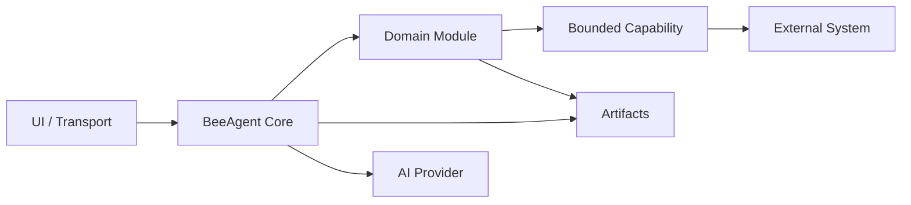

# BeeAgent — модульный агентный runtime для bounded AI workflows

**BeeAgent** — модульный stateful runtime для создания explainable AI-систем с явными границами между orchestration, доменной логикой, внешними capabilities и пользовательскими интерфейсами.

BeeAgent не задуман как чат-бот с неограниченным набором tools.

Базовая модель:

```text
UI / Transport
      ↓
BeeAgent Core
      ↓
Domain Module
      ↓
Bounded Capability
      ↓
External System
```

Runtime владеет state, policy, authority, artifacts, загрузкой модулей, execution boundaries и observability.

Доменная бизнес-логика живёт в отдельных модулях.

## Зачем BeeAgent

В AI-приложениях часто смешиваются в одном месте:

- conversation state;
- бизнес-правила;
- tool execution;
- credentials;
- внешние API;
- approvals;
- UI;
- persistence;
- AI decisions.

BeeAgent разделяет эти ответственности.

Главный архитектурный принцип:

> Domain intent должен быть отделён от execution authority.

Модуль может запросить разрешённую операцию, но не получает автоматически доступ к shell, filesystem, RPC, credentials или внешней системе.

BeeAgent остаётся host и policy boundary.

## Архитектура



### BeeAgent Core

Core владеет платформенным поведением:

- runtime и session context;
- run identity;
- конфигурацией и fail-fast validation;
- обнаружением и загрузкой модулей;
- module dispatch;
- artifact storage API;
- approvals и policy;
- capability boundaries;
- bounded external execution;
- logging и observability;
- transport/UI integration;
- authentication и authorization surfaces;
- timeout, lifecycle и cleanup behavior.

### Доменные модули

Модули владеют бизнес- или продуктовыми semantics.

В модуле должны жить:

- domain models;
- rules;
- classification;
- analysis;
- recommendations;
- domain-specific evaluation;
- domain-specific artifacts.

Модуль не должен становиться вторым runtime.

Он не должен владеть generic:

- process lifecycle;
- credential management;
- storage infrastructure;
- arbitrary network execution;
- transport handling;
- global authentication;
- host policy.

Доменные модули могут быть публичными или приватными.

Это позволяет оставить сам BeeAgent переиспользуемым framework, а коммерческие или customer-specific продукты хранить в отдельных приватных пакетах.

### Capabilities

Capability — узкий host-controlled integration или execution surface.

Примеры:

- внешние API;
- MCP tools;
- workflow-системы вроде n8n;
- локальная обработка документов;
- isolated blockchain execution;
- CRM integrations;
- другие bounded system operations.

Capability — не универсальный escape hatch.

Целевая модель:

```text
module intent
    ↓
host validation
    ↓
scoped capability
    ↓
approved operation
    ↓
bounded evidence/result
```

Long-running state должен жить в BeeAgent, а не внутри одного внешнего tool call.

## Module Contract

BeeAgent загружает package-based доменные модули через config-driven registry.

Текущая модель модуля намеренно небольшая:

```python
class ModuleContract(Protocol):
    @property
    def module_id(self) -> str: ...

    @property
    def authority(self) -> AuthorityLevel: ...

    def supported_case_types(self) -> list[str]: ...

    def handle(self, context: ModuleContext) -> ModuleResult: ...
```

Во время выполнения BeeAgent создаёт context и привязывает его к host-owned run и session.

Концептуально:

```text
ModuleContext
├── run_id
├── session_id
├── module_id
├── case_type
├── authority
├── payload
├── artifact_api
└── capability_caller
```

Модуль возвращает bounded `ModuleResult`.

BeeAgent остаётся владельцем host execution и persistence.

## Authority Model

BeeAgent использует явные уровни authority:

```text
read_only
draft_only
execution_capable
```

Authority самого модуля не равна execution authority хоста.

Например, `read_only` модуль может получить host-scoped capability для одной конкретной isolated operation, не становясь при этом произвольно execution-capable.

Сохраняется правило:

```text
module intent != execution authority
```

## Artifacts и explainability

BeeAgent построен вокруг artifacts.

Runs могут сохранять structured evidence в `storage/`:

```text
storage/
├── runs/
├── artifacts/
├── reports/
├── interfaces/
├── sessions/
└── telemetry/
```

Artifacts используются для:

- воспроизводимости;
- debugging;
- operator review;
- module outputs;
- integration evidence;
- read models;
- audit-friendly execution traces.

Базовый принцип:

> Важное runtime-поведение должно объясняться через config, logs и artifacts.

Artifacts должны оставаться bounded и не содержать secrets или unrestricted raw external data.

## AI Model

AI — assistive layer, а не authority boundary.

BeeAgent поддерживает configurable AI provider profiles и bounded provider calls, но AI output должен пройти application-specific validation до того, как сможет повлиять на deterministic state или execution.

Целевая модель:

```text
deterministic evidence
        +
bounded AI assistance
        ↓
validated result
        ↓
policy-controlled action
```

AI output автоматически не даёт:

- CRM mutation;
- mailbox mutation;
- arbitrary tool execution;
- filesystem access;
- credential access;
- authority во внешней системе.

Critical execution authority остаётся host-controlled.

## Интерфейсы и transports

BeeAgent поддерживает несколько surfaces взаимодействия.

### Telegram

Telegram может использоваться как operator transport для интерактивных workflows.

```bash
./start.sh telegram
```

### Operator Web Console

BeeAgent включает BeeUI-backed Web Console:

```bash
./start.sh web
```

Web layer предоставляет платформенные surfaces:

- dashboard;
- run history;
- run details;
- module diagnostics;
- bounded artifact views;
- JSON API;
- authenticated operator surfaces.

Web access может быть защищён config-driven principals, roles, scopes и signed BeeUI sessions.

Default bind локальный:

```text
127.0.0.1
```

При external deployment необходимо использовать authentication boundary и соответствующий deployment hardening.

### CLI

Canonical entrypoint:

```bash
./start.sh
```

Основные framework-level команды:

```bash
./start.sh
./start.sh telegram
./start.sh web
./start.sh web --host 127.0.0.1 --port 8780 --no-open
./start.sh routes
./start.sh docling-assets-prepare

./start.sh auth rotate <principal>
./start.sh auth rotate all
./start.sh auth rotate all --logout-all
./start.sh auth rotate session
```

Отдельные доменные модули могут добавлять workflow-specific CLI commands.

Они не являются core BeeAgent module contract.

## Локальная обработка документов

BeeAgent включает bounded local document-extraction path.

Текущий реализованный engine:

```text
Docling
+ RapidOCR
+ ONNX Runtime
```

Поддерживается bounded обработка:

- text;
- CSV;
- PDF;
- DOCX;
- XLSX;
- JPEG;
- PNG.

Document parsing выполняется через bounded local worker с timeout и explicit failure handling.

Содержимое клиентских документов считается untrusted input.

Инструкции внутри документа не дают execution authority.

Если соответствующий extractor включён, model assets подготавливаются заранее, а runtime не выполняет silent model download во время обработки документа.

## Конфигурация

Runtime source of truth:

```text
config/settings.yml
```

Secrets живут в environment variables или `.env`, а не в YAML.

Startup path:

- создаёт `.env` из `.env.example`, если его нет;
- синхронизирует отсутствующие env keys без перезаписи существующих значений;
- генерирует разрешённые internal secrets там, где это предусмотрено;
- валидирует required configuration;
- определяет runtime dependency profile;
- запускает выбранный runtime.

External credentials никогда не генерируются автоматически.

Типичные примеры:

- AI provider credentials;
- Telegram credentials;
- mailbox credentials;
- CRM credentials;
- credentials внешних connectors.

## Security Model

BeeAgent по умолчанию считает внешний input недоверенным.

Основные правила:

- secrets должны храниться через environment-backed storage;
- required security-sensitive config валидируется fail-fast;
- module intent не равен execution authority;
- capabilities имеют явный scope;
- arbitrary caller-selected executable paths не являются capability contract;
- bounded execution paths не принимают произвольные RPC targets;
- artifact access строится через allowlist;
- path traversal должен fail closed;
- raw secrets не должны попадать в logs или artifacts;
- external failure должен оставаться explicit failure, а не превращаться в successful evidence;
- execution-capable paths требуют более строгого review, чем read-only paths;
- local development defaults не должны незаметно становиться production security defaults.

Подробные правила находятся в [`docs/SECURITY.md`](docs/SECURITY.md).

## Структура проекта

```text
beeagent/
├── config/
│   ├── start.py
│   ├── settings.yml
│   ├── beeui.yml
│   ├── prompts.yml
│   └── i18n/
├── docs/
│   ├── ARCHITECTURE.md
│   ├── DEV_GUIDE.md
│   ├── ROADMAP.md
│   ├── SDLC.md
│   ├── SECURITY.md
│   ├── SPEC.md
│   └── WEB_UI.md
├── src/
│   └── beeagent_module/
│       ├── adapters/
│       ├── agents/
│       ├── cases/
│       ├── cli/
│       ├── core/
│       ├── domain/
│       ├── interfaces/
│       │   └── ui/
│       ├── mock/
│       ├── ui/
│       └── web/
├── storage/
├── tests/
├── pyproject.toml
├── start.sh
└── uv.lock
```

Главная архитектурная граница важнее конкретной структуры каталогов:

```text
BeeAgent
  = host runtime + orchestration + authority

Domain module
  = business/product semantics

Capability
  = bounded external execution/integration

BeeUI / transport
  = interaction layer
```

## Требования

BeeAgent сейчас ориентирован на:

```text
Python >= 3.14
uv
```

Если `uv` отсутствует, `start.sh` умеет bootstrap'ить его.

Для reproducible development и runtime setup используется locked `uv` environment.

## Development Setup

### Важно: текущая workspace dependency model

Текущий `main` пока разрабатывается как часть Bee workspace.

В `pyproject.toml` сейчас объявлены sibling editable sources, включая:

```text
../beesdk
../beedrill
../beeagent-rop
```

Некоторые доменные модули могут быть приватными.

Поэтому текущий репозиторий **пока не является полностью standalone external installation из свежего public clone**.

Это ограничение текущего packaging/dependency boundary, а не архитектурное требование BeeAgent.

Целевая framework-модель предполагает, что доменные модули устанавливаются независимо и при необходимости остаются приватными.

### Разработка внутри Bee workspace

Если необходимые sibling packages доступны:

```bash
git clone https://github.com/beesyst/beeagent.git
cd beeagent

./start.sh
```

Явный runtime:

```bash
./start.sh telegram
```

или:

```bash
./start.sh web
```

Тесты:

```bash
uv run --frozen pytest -q
```

Canonical application entrypoint — `./start.sh`; отдельная install-команда для текущего workspace development flow не требуется.

## Расширение BeeAgent

При добавлении нового продукта или customer workflow предпочтительно создавать отдельный domain package, а не добавлять бизнес-правила в BeeAgent core.

Типичная интеграция:

```text
my-domain-module
        ↓
ModuleContract
        ↓
BeeAgent runtime
        ↓
Artifact API + scoped capabilities
        ↓
external systems
```

В BeeAgent core функциональность должна попадать только тогда, когда она действительно platform-level.

Примеры platform-level behavior:

- runtime context;
- policy;
- artifact infrastructure;
- generic module loading;
- authorization;
- capability dispatch;
- process lifecycle;
- shared transport behavior.

Примеры module-level behavior:

- customer classification rules;
- security scenario semantics;
- sales logic;
- domain scoring;
- domain-specific recommendations;
- customer-specific workflow decisions.

## Public Core, Private Products

Архитектура BeeAgent намеренно допускает сочетание open и private компонентов.

Например:

```text
Public or reusable
├── BeeAgent runtime
├── shared SDK/contracts
└── reusable infrastructure

Private or product-specific
├── customer modules
├── commercial domain logic
├── customer configuration
└── proprietary integrations
```

Таким образом orchestration framework может оставаться переиспользуемым, не заставляя публиковать коммерческую доменную логику.

## Принципы разработки

BeeAgent следует небольшому набору архитектурных правил:

1. **KISS** — абстракции добавляются только когда их требует реальное поведение.
2. **Config is source of truth** — required runtime behavior должен быть explicit.
3. **Explainability first** — важное поведение должно объясняться через config, logs и artifacts.
4. **Thin UI** — UI не должен обходить runtime/module boundaries.
5. **Module boundary** — бизнес-логика принадлежит domain modules.
6. **Bounded capabilities** — external execution должен быть узким и host-controlled.
7. **Bounded AI** — AI помогает принимать решения, но не получает unrestricted authority.
8. **Fail closed** — отсутствие или противоречивость critical evidence не должны превращаться в success.

## Документация

Подробная документация находится в [`docs/`](docs/):

- [`docs/ARCHITECTURE.md`](docs/ARCHITECTURE.md) — ownership и system boundaries;
- [`docs/SPEC.md`](docs/SPEC.md) — текущие platform contracts;
- [`docs/ROADMAP.md`](docs/ROADMAP.md) — stages и iterations;
- [`docs/DEV_GUIDE.md`](docs/DEV_GUIDE.md) — development и runtime workflows;
- [`docs/SDLC.md`](docs/SDLC.md) — lightweight development process;
- [`docs/SECURITY.md`](docs/SECURITY.md) — security engineering rules;
- [`docs/WEB_UI.md`](docs/WEB_UI.md) — contract Operator Web Console.

Для implementation details источником правды являются эти документы, а не README.
