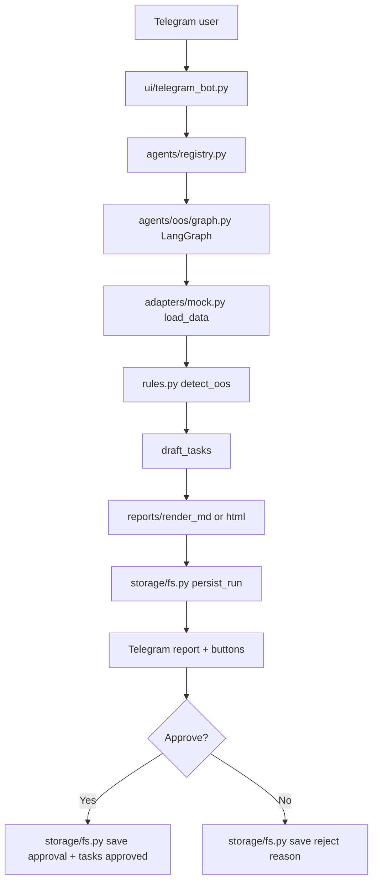

# ARCHITECTURE — BeeAgent (KISS, modular)

## Идея
Есть "ядро процессов" (LangGraph) и тонкий интерфейс (Telegram).
Данные и интеграции вынесены в адаптеры: сейчас mock, позже 1C/BI/CRM.
Отчёты и задачи — артефакты, сохраняются в `storage/`.

## Поток данных (pre-MVP)
1) Пользователь в Telegram жмёт "Run OOS Scan"
2) Telegram UI вызывает `AgentRunner.run(agent_id="oos")`
3) LangGraph выполняет шаги:
   - load_data (mock)
   - detect_oos (rules)
   - draft_tasks (draft)
   - render_report (markdown/html)
   - persist_run (storage)
4) Telegram показывает отчёт + кнопки approve/reject
5) Approval сохраняется как событие и меняет статус задач

## Каталоги проекта (рекомендуемая структура)
repo/
├── start.sh
├── pyproject.toml
├── .env.example
├── config/
│   ├── start.py
│   └── settings.yml
├── docs/
│   ├── SPEC.md
│   ├── ROADMAP.md
│   ├── ARCHITECTURE.md
│   ├── CONFIG.md
│   └── DEV_GUIDE.md
├── src/
│   └── beeagent_module/
│       ├── __init__.py
│       ├── core/
│       │   ├── settings.py      # YAML + env, fail-fast
│       │   ├── log.py           # logs/app.log
│       │   └── paths.py         # storage/, logs/
│       ├── ui/
│       │   └── telegram_bot.py  # handlers, buttons, allowlist
│       ├── agents/
│       │   ├── registry.py      # agent_id -> runner
│       │   └── oos/
│       │       ├── graph.py     # langgraph graph
│       │       ├── rules.py     # detect_oos rules
│       │       └── prompts.py   # LLM templates (optional)
│       ├── adapters/
│       │   ├── base.py          # DataAdapter interface
│       │   └── mock.py          # MockAdapter
│       ├── domain/
│       │   └── models.py        # Store/SKU/Sales/Stock/Alert/Task/RunMeta
│       ├── reports/
│       │   ├── render_md.py
│       │   └── render_html.py
│       ├── storage/
│       │   ├── fs.py            # save/load runs/tasks/artifacts
│       │   └── schema.py        # filenames conventions
│       └── app.py               # сборка приложения (wiring)
├── storage/                     # runtime artifacts (gitignored)
├── logs/
└── tests/

## Где хранить "клиентские требования"
KISS-подход:
- `clients/<client_slug>/` — конфиги и правила клиента (yaml/json), без кода
- `adapters/<client_slug>/` — интеграции (если нужно) как код

На pre-MVP можно вообще без `clients/` и просто сделать:
- `config/settings.yml` с "pilot_category", "thresholds", "top_sku_count".

## Что такое "агент" у нас
Агент = модуль в `beeagent_module/agents/<agent_id>/`:
- `graph.py` (LangGraph)
- `rules.py` (детерминированная логика)
- `prompts.py` (LLM-текст для объяснений)
- `README.md` (коротко: inputs/outputs)

Никакой сложной системы плагинов.

## Mermaid-схема (pre-MVP)

