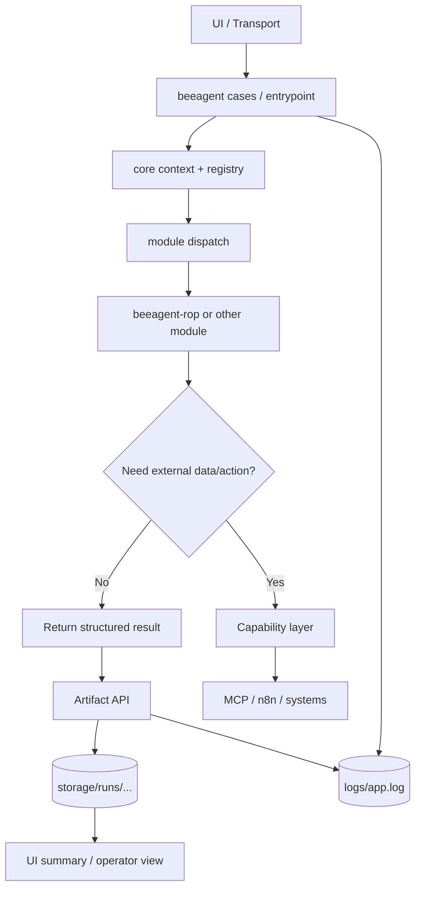

# ARCHITECTURE — BeeAgent (KISS, modular, stateful)

## Идея

Есть **ядро оркестрации** (`beeagent`) и **подключаемые доменные модули** (`beeagent-rop`, в будущем `beescan`, `merch`).

`beeagent` не должен содержать клиентскую бизнес-логику.
Его задача — держать:

- runtime state;
- run/session/job context;
- approvals;
- artifacts;
- module dispatch;
- capability boundary;
- transport/UI integration.

Доменные модули не должны становиться “вторым ядром”.
Их задача — решать свой бизнес-кейс внутри contracts, которые даёт BeeAgent.

## Основной принцип

Правильная схема такая:

`UI/transport → BeeAgent core → module → capability/MCP/n8n → systems`

Где:

- **UI/transport** — Telegram, позже web/Bitrix/другой интерфейс;
- **BeeAgent core** — orchestration, state, approvals, artifacts, policy;
- **module** — доменная логика (`ROP`, позже другие);
- **capability/MCP/n8n** — execution/integration layer;
- **systems** — Bitrix, 1С, email, внешние сервисы и т.д.

## Что живёт в BeeAgent

В `beeagent` живёт только платформенный слой:

- загрузка config и fail-fast validation;
- run/session/job context;
- stateful orchestration;
- case dispatch;
- module contract и registry;
- artifact API;
- capability boundary;
- transport/UI layer;
- observability/logging;
- approvals и bounded execution semantics.

## Bitrix write-back execution boundary (Iteration 37)

BeeAgent владеет bounded execution-capable Bitrix write-back path для ROP-событий:

- `BitrixReadonlyClient` остаётся строго read-only; `crm.activity.list` используется
  только для idempotency reconciliation и не даёт mutation capability;
- отдельный `BitrixWriteClient` — bounded execution boundary с собственным allowlist
  точных mutation methods (`crm.item.add`, `crm.activity.add`, и, только для
  физической доставки attachment files It40, `crm.activity.update`) и отдельным
  env-backed write credential;
- attachment lifecycle (It40) — BeeAgent-owned bounded opaque store
  `storage/attachments/<run_id>/` + per-run manifest, authenticated download и
  physical-file Bitrix delivery; `beeagent-rop` потребляет только bounded
  attachment extraction contract;
- authoritative write-back state живёт в `storage/interfaces/rop_writeback_state.json`
  (durable, cross-run, idempotent), per-run операторская проекция —
  `rop_writeback_summary.json`;
- `beeagent-rop` остаётся источником классификационной семантики и не меняется;
  write-back authority находится в BeeAgent server-side policy, а не в AI/final
  decision/`should_rop_see`/action drafts.

## Что НЕ живёт в BeeAgent

В `beeagent` не должна жить клиентская логика вида:

- как определять новый лид;
- как искать дубли;
- как строить ROP summary;
- как читать attachment в контексте Welding;
- как интерпретировать входящий поток конкретного клиента.

Это должно жить в модуле.

## Что живёт в модуле

В модуле живёт доменная логика:

- domain models;
- rules;
- classification;
- deduplication;
- summary building;
- recommendation building;
- client-specific case semantics.

## Что НЕ живёт в модуле

В модуле не должны жить:

- transport handlers;
- собственный orchestrator;
- собственный runtime state engine;
- собственное storage ядро;
- хаотичные прямые вызовы в UI;
- хаотичные прямые вызовы в systems, если для этого уже есть capability boundary.

## Поток данных (целевая схема)

1. Пользователь или оператор запускает сценарий через UI/transport.
2. UI вызывает case/entrypoint внутри BeeAgent.
3. BeeAgent определяет:
   - `run_id`
   - `session_id`
   - `module_id`
   - `case_type`
4. BeeAgent через registry выбирает нужный модуль.
5. Модуль получает `ModuleContext`.
6. Модуль выполняет свою доменную логику.
7. Если нужны внешние действия или данные, модуль идёт через capability layer.
8. Результат сохраняется в artifacts через BeeAgent artifact API.
9. UI/transport показывает summary / next action / diagnostics.

## Поток для длинной задачи

Длинная задача должна жить в BeeAgent, а не внутри одного tool/MCP вызова.

То есть:

- job state;
- checkpoints;
- retries;
- batching;
- approval state;
- intermediate artifacts

должны жить в BeeAgent runtime.

MCP/n8n — это execution/integration layer, а не место хранения job state.

## Каталоги проекта (beeagent)

Рекомендуемая структура:

```
repo/
├── start.sh
├── pyproject.toml
├── config/
│   ├── start.py
│   ├── settings.yml
│   ├── prompts.yml
│   └── i18n/
├── docs/
│   ├── ROADMAP.md
│   ├── SDLC.md
│   ├── SECURITY.md
│   ├── ARCHITECTURE.md
│   └── DEV_GUIDE.md
├── src/
│   └── beeagent_module/
│       ├── core/
│       │   ├── app.py
│       │   ├── settings.py
│       │   ├── log.py
│       │   ├── paths.py
│       │   ├── llm.py
│       │   ├── normalize.py
│       │   ├── modules.py        # module contract / registry / loader
│       │   ├── artifacts.py      # artifact API
│       │   ├── capabilities.py   # capability boundary
│       │   └── context.py        # ModuleContext / RunContext / SessionContext
│       ├── cases/
│       │   ├── ...
│       ├── agents/
│       │   ├── ...
│       ├── adapters/
│       │   ├── ...
│       ├── domain/
│       │   ├── ...
│       └── ui/
│           ├── telegram_bot.py
│           └── ...
├── storage/
├── logs/
└── tests/
```

## Что такое module contract у нас

Модуль — это обычный Python package, который подключается к BeeAgent как локальная зависимость.

Минимально модуль должен иметь:

- `module_id`
- `supported_case_types()`
- `handle(context)`

Где `context` содержит минимум:

- `run_id`
- `session_id`
- `module_id`
- `case_type`
- input payload
- доступ к artifacts/capabilities через bounded API

Без “сложной” системы плагинов.
Без remote marketplace.
Без dynamic install на старте.

## Что такое capability у нас

Capability — это bounded способ сходить наружу:

- в MCP;
- в n8n;
- в другой integration layer;
- в system connector.

Модуль не должен знать все детали transport/execution слоя.

Он должен говорить примерно так:

- “получи данные”
- “вызови workflow”
- “сделай bounded action”

А уже BeeAgent capability layer решает, как именно это происходит.

## Где должны жить клиентские модули

Отдельными репозиториями:

- `beeagent-rop`
- `beescan`
- `beeagent-merch`

И подключаться к `beeagent` как локальные/editable зависимости.

## Что такое UI у нас

UI — это тонкий слой.

Он не должен:

- содержать клиентскую бизнес-логику;
- читать storage напрямую;
- решать, как работает модуль;
- подменять orchestration core.

UI должен:

- принимать команду/событие;
- вызвать case/module flow;
- показать результат.

## Mermaid-схема


